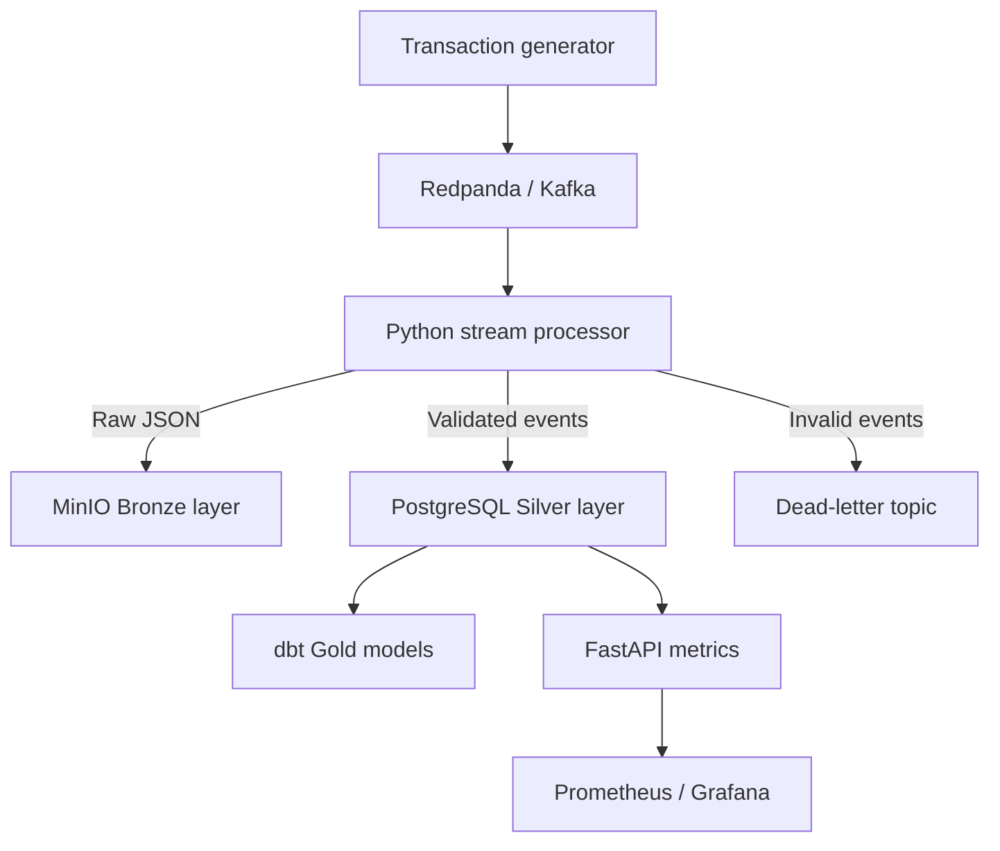
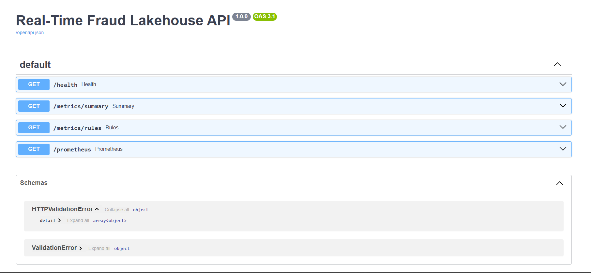
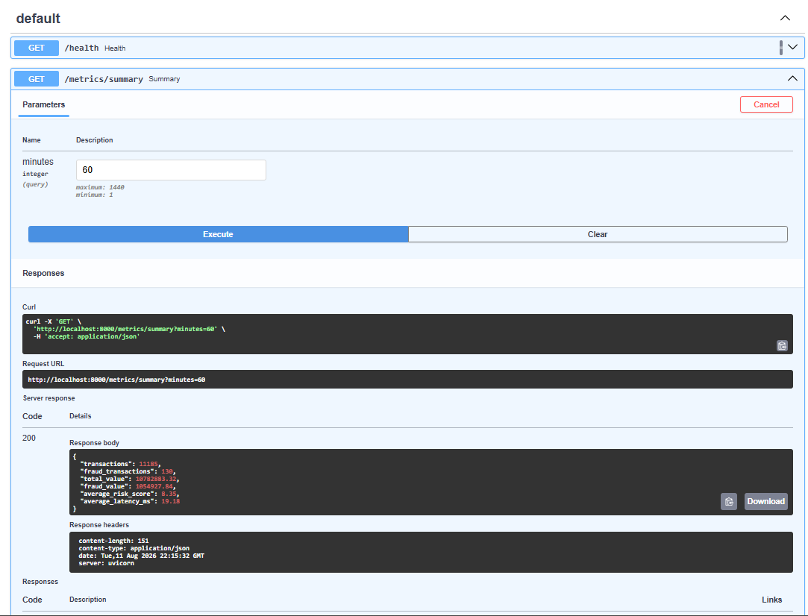
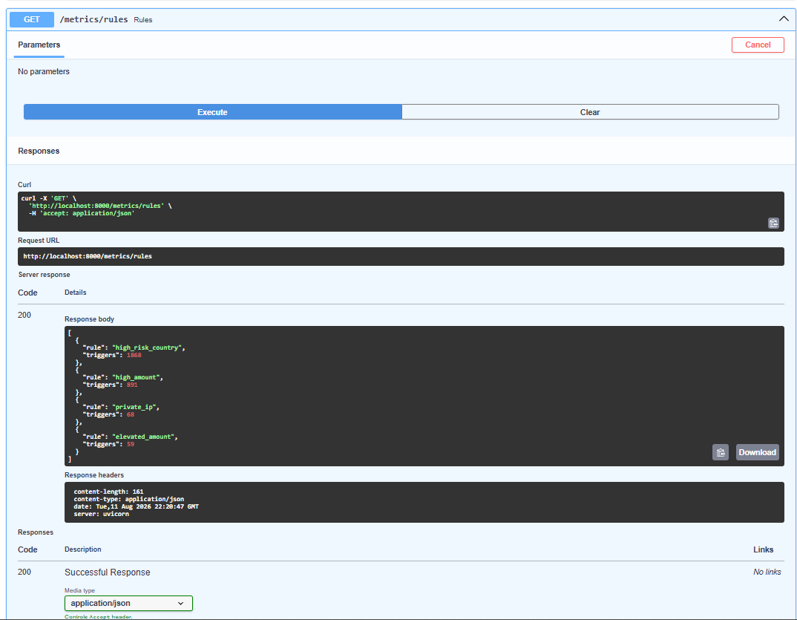
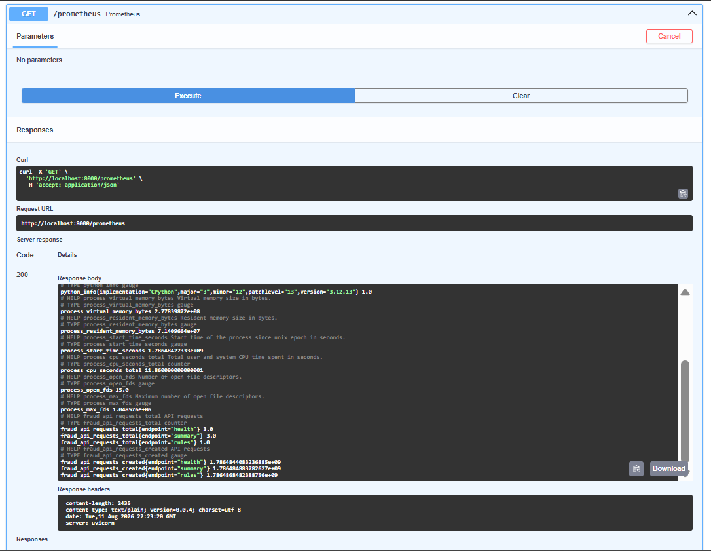
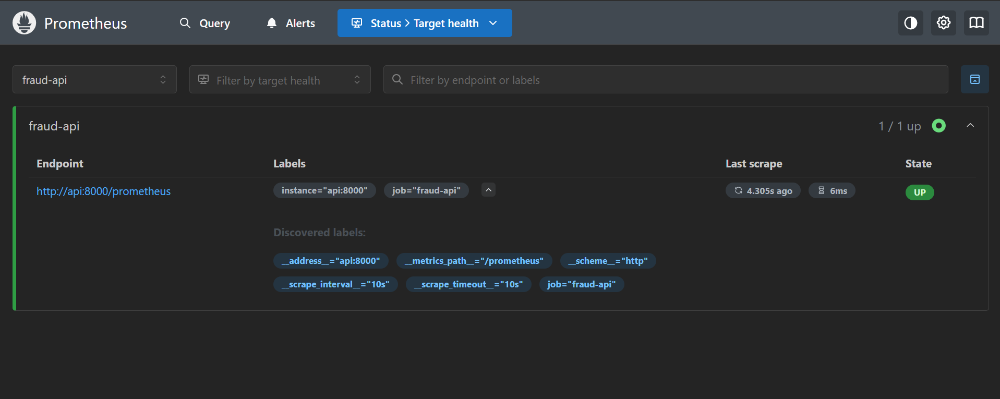

# Real-Time Banking Fraud Detection Lakehouse

[](https://github.com/Banoth281/real-time-fraud-detection-lakehouse/actions/workflows/ci.yml)

A production-style data engineering project that generates synthetic banking transactions, ingests them through a Kafka-compatible stream, applies schema and fraud-quality rules, archives immutable Bronze events in an S3-compatible data lake, and persists analytics-ready Silver/Gold data in PostgreSQL.

## Architecture



## Engineering features

- Kafka-compatible keyed event ingestion with idempotent production
- Pydantic schema contracts and explicit data-quality checks
- Stateful five-minute account velocity detection
- Fraud scoring for amount, country, velocity, time and IP signals
- Dead-letter queue for invalid records
- Immutable date-partitioned Bronze objects in MinIO
- Idempotent PostgreSQL writes using event and transaction identifiers
- Manual Kafka offset commits after successful persistence
- Indexed Silver table and hourly Gold analytics view
- dbt daily Gold model with uniqueness and not-null tests
- FastAPI operational and business metrics
- Optional Prometheus and Grafana monitoring profile
- Unit tests and GitHub Actions CI

## Technology stack

Python 3.12, Redpanda/Kafka, PostgreSQL 16, MinIO/S3, dbt, FastAPI, Prometheus, Grafana, Docker Compose, Pydantic, pytest and GitHub Actions.

## Resource-aware deployment

The default core stack is limited to approximately 1.9 GB of container memory. Monitoring is an optional profile so the project can run on machines with a 4 GB Docker memory allocation.

## Quick start on Windows

```powershell
Copy-Item .env.example .env
docker compose up --build -d
docker compose ps
```

Wait about one minute, then open:

- API documentation: http://localhost:8000/docs
- Health check: http://localhost:8000/health
- Fraud summary: http://localhost:8000/metrics/summary?minutes=60
- Triggered rules: http://localhost:8000/metrics/rules
- MinIO console: http://localhost:9001 (`minioadmin` / `minioadmin`)

View the live stream:

```powershell
docker compose logs -f producer processor api
```

Start optional monitoring:

```powershell
docker compose --profile monitoring up -d
```

- Grafana: http://localhost:3000 (`admin` / `admin`)
- Prometheus: http://localhost:9090

Stop services:

```powershell
docker compose down
```

Remove containers and generated data:

```powershell
docker compose down -v
```

## Run tests locally

```powershell
python -m venv .venv
.\.venv\Scripts\Activate.ps1
pip install -r requirements.txt
pytest -q
```

## Data layers

| Layer | Storage | Purpose |
|---|---|---|
| Bronze | MinIO JSON objects | Immutable replayable source events partitioned by date |
| Silver | PostgreSQL `transactions` | Validated, deduplicated and fraud-enriched events |
| Gold | SQL view and dbt model | Hourly/daily stakeholder metrics and fraud exposure |

## Reliability design

The processor writes the Bronze record and Silver transaction before committing the Kafka offset. PostgreSQL primary and unique keys make event replays safe. Invalid messages are isolated in a dead-letter topic rather than blocking the stream. This provides at-least-once processing with idempotent persistence.

## Suggested resume bullet

> Built a containerised real-time banking fraud lakehouse using Python, Kafka-compatible Redpanda, MinIO and PostgreSQL. Implemented schema validation, stateful velocity rules, dead-letter handling, Bronze/Silver/Gold modelling, idempotent writes, manual offset management, dbt transformations, FastAPI metrics and CI/CD.

## Data notice

All banking records are synthetic and generated solely for engineering demonstrations. No real customer or financial data is used.


## Live Project Screenshots

### Fraud Lakehouse API


### Real-Time Fraud Summary


### Fraud Detection Rules


### Prometheus Monitoring Metrics


### Prometheus Target Health

